# Image Texture Clustering Project

This repository contains an image clustering project implemented in **`image-clustering.ipynb`**. The goal is to cluster texture/material images based on handcrafted visual features, then evaluate and visualize the quality of the clustering results.

The project follows the requirements described in `project1.pdf`: feature extraction, feature selection, clustering, visualization, evaluation, and prediction on test images.

## Dataset

The dataset contains texture images from **9 material/surface classes**. Each class contains `train` and `test` images captured under different lighting conditions, viewpoints, and scales.

Dataset download link:

[Download Dataset from Google Drive](https://drive.google.com/file/d/1ANrLC-kd-FbPXdoIMnHJx9MV4WIedncP/view?usp=sharing)

After downloading and extracting the dataset, place the class folders next to `image-clustering.ipynb`.

Expected structure:

```text
project-root/
├── image-clustering.ipynb
├── README.md
├── project1.pdf
├── aluminium_foil/
│   ├── train/
│   └── test/
├── brown_bread/
│   ├── train/
│   └── test/
├── corduroy/
│   ├── train/
│   └── test/
├── ...
```

The notebook automatically scans all folders that contain a `train` subdirectory and builds the image manifest from them.

## Project Objective

The objective is to group visually similar texture images into clusters, even when images from the same class are captured under different:

- lighting conditions,
- camera viewpoints,
- scales,
- local texture variations.

The project does not use pretrained models. All features are manually extracted using image processing and statistical methods.

## Implemented Phases

## Phase 1: Feature Extraction

The notebook extracts handcrafted features from every image and stores them in `features_all.csv`.

Extracted feature groups include:

### RGB color statistics

- `mean_r`
- `mean_g`
- `mean_b`
- `std_r`
- `std_g`
- `std_b`

### HSV color statistics

- `hsv_mean_h`
- `hsv_mean_s`
- `hsv_mean_v`
- `hsv_std_h`
- `hsv_std_s`
- `hsv_std_v`

### Lab color statistics

- `lab_mean_l`
- `lab_mean_a`
- `lab_mean_b`
- `lab_std_l`
- `lab_std_a`
- `lab_std_b`

### Intensity and edge features

- `intensity_entropy`
- `edge_density`
- `sobel_mean`
- `laplacian_variance`

### Frequency-domain features

- `freq_low_ratio`
- `freq_high_ratio`
- `freq_contrast`

### GLCM texture features

- `glcm_contrast`
- `glcm_dissimilarity`
- `glcm_homogeneity`
- `glcm_correlation`
- `glcm_energy`

In total, the notebook extracts **30 handcrafted features**, which satisfies the requirement of extracting at least 7 features.

Generated output:

```text
features_all.csv
```

This file contains:

- image path,
- class name,
- split type,
- all extracted feature values.


<figure>
  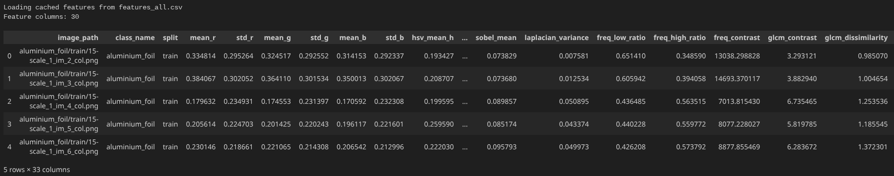
  <figcaption>Dataset overview and extracted features</figcaption>
</figure>


## Phase 2: Feature Selection

The notebook performs feature selection to reduce redundancy and keep a smaller, more useful subset of features.

The implemented feature selection process includes:

1. Manual correlation matrix calculation.
2. Fisher score calculation for each feature.
3. Sequential forward feature search.
4. Selection of the best feature subset using a combined clustering objective.

The correlation matrix is implemented manually instead of using ready-made functions such as `np.corrcoef`.

The selected final features in the notebook are:

```text
lab_mean_b
hsv_mean_s
hsv_mean_h
```

Generated output:

```text
selected_features.csv
```

This file stores the selected feature subset for later clustering and prediction phases.


<figure>
  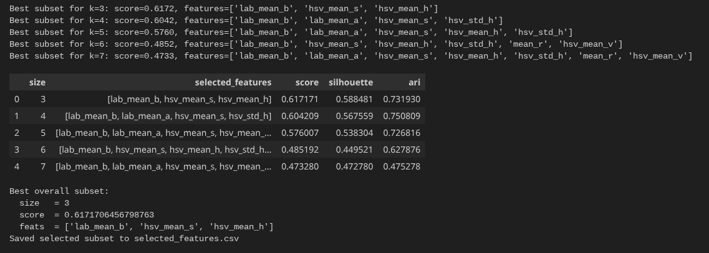
  <figcaption>Feature selection history</figcaption>
</figure>

<figure>
  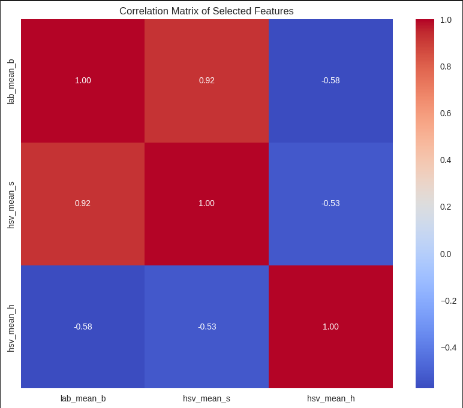
  <figcaption>Selected feature correlation heatmap</figcaption>
</figure>

<figure>
  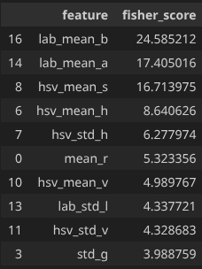
  <figcaption>Top Fisher scores</figcaption>
</figure>

## Phase 3: Clustering and Hyperparameter Tuning

The selected features are standardized using `StandardScaler`, then clustering is performed using four algorithms:

1. KMeans
2. DBSCAN
3. Agglomerative Clustering
4. MeanShift

The notebook performs hyperparameter tuning for each algorithm and stores the best configuration.

### KMeans

The notebook tunes parameters such as:

- number of clusters,
- initialization method,
- number of initializations,
- maximum iterations.

Best reported KMeans configuration:

```text
Representation: scaled
Parameters: {'init': 'random', 'max_iter': 300, 'n_clusters': 9, 'n_init': 25}
Silhouette score: 0.5914
```

### Agglomerative Clustering

The notebook tunes parameters such as:

- number of clusters,
- linkage method,
- distance metric.

Best reported Agglomerative configuration:

```text
Representation: pca_3
Parameters: {'linkage': 'complete', 'metric': 'manhattan', 'n_clusters': 9}
Silhouette score: 0.5969
```

### DBSCAN

The notebook tunes parameters such as:

- `eps`,
- `min_samples`,
- nearest-neighbor distance quantile,
- `eps_scale`,
- `leaf_size`.

Best reported DBSCAN configuration:

```text
Representation: scaled
Parameters: {'eps': 0.1953318665474665, 'min_samples': 3, 'leaf_size': 30, 'quantile': 0.95, 'eps_scale': 1.15}
Silhouette score: 0.5893
```

### MeanShift

The notebook tunes parameters such as:

- bandwidth,
- quantile,
- bandwidth multiplier.

Best reported MeanShift configuration:

```text
Representation: scaled
Silhouette score: 0.6216
```
<figure>
  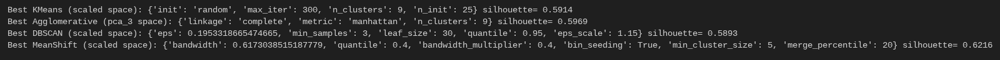
  <figcaption>Best clustering configurations</figcaption>
</figure>

<figure>
  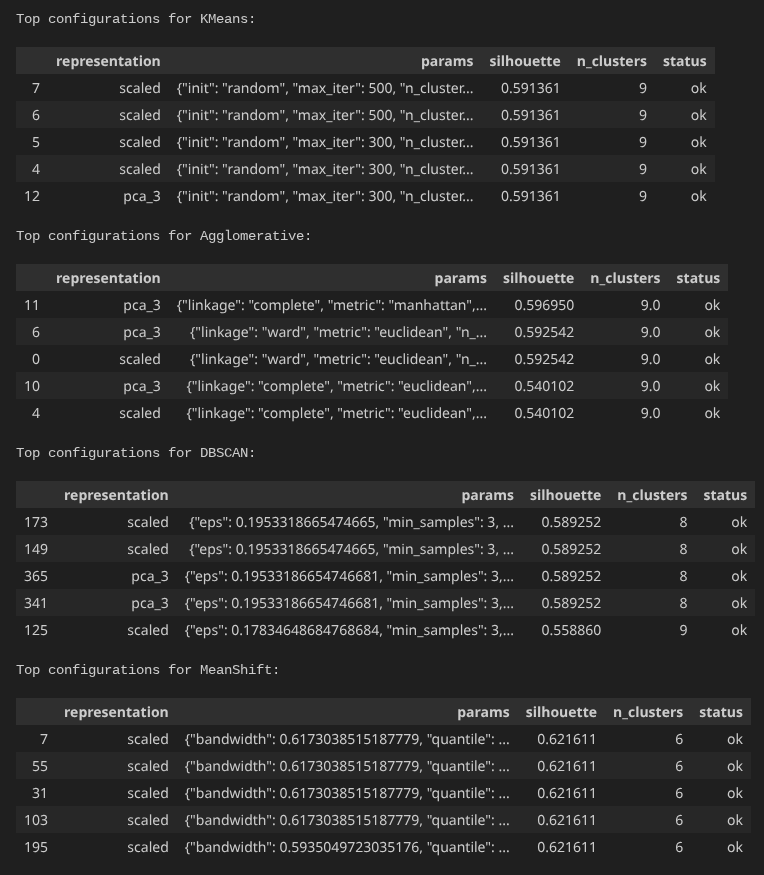
  <figcaption>Top hyperparameter tuning tables</figcaption>
</figure>

## Cluster Heatmaps

For each clustering algorithm, the notebook plots a heatmap of the mean value of each selected feature inside each cluster. These heatmaps help analyze which features are more important for distinguishing clusters.

Generated heatmaps:

- KMeans feature mean heatmap
- Agglomerative feature mean heatmap
- DBSCAN feature mean heatmap
- MeanShift feature mean heatmap


<figure>
  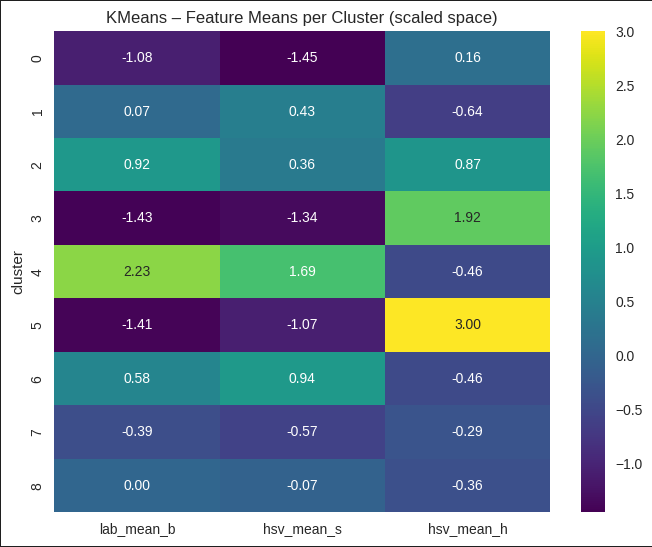
  <figcaption>KMeans cluster feature heatmap</figcaption>
</figure>

<figure>
  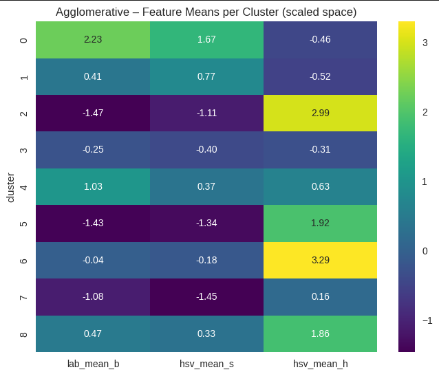
  <figcaption>Agglomerative cluster feature heatmap</figcaption>
</figure>

<figure>
  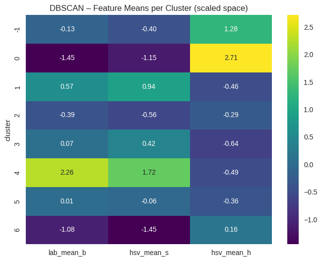
  <figcaption>DBSCAN cluster feature heatmap</figcaption>
</figure>

<figure>
  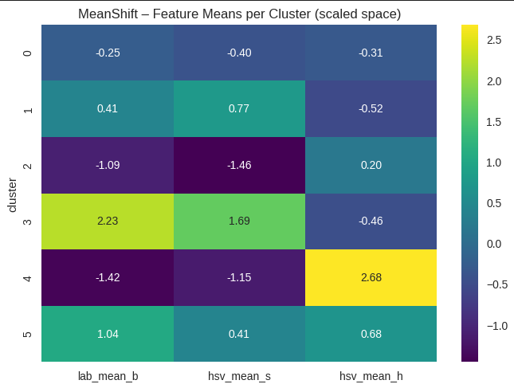
  <figcaption>MeanShift cluster feature heatmap</figcaption>
</figure>


## Phase 4: Dimensionality Reduction and Visualization

The notebook uses PCA to reduce the selected feature space into 2D for visualization.

Each clustering result is visualized in the PCA space. The plot shows how each algorithm separates the images into clusters.

The visualization includes:

- KMeans clusters,
- Agglomerative clusters,
- DBSCAN clusters,
- MeanShift clusters.

### Required screenshot: PCA clustering visualization

<figure>
  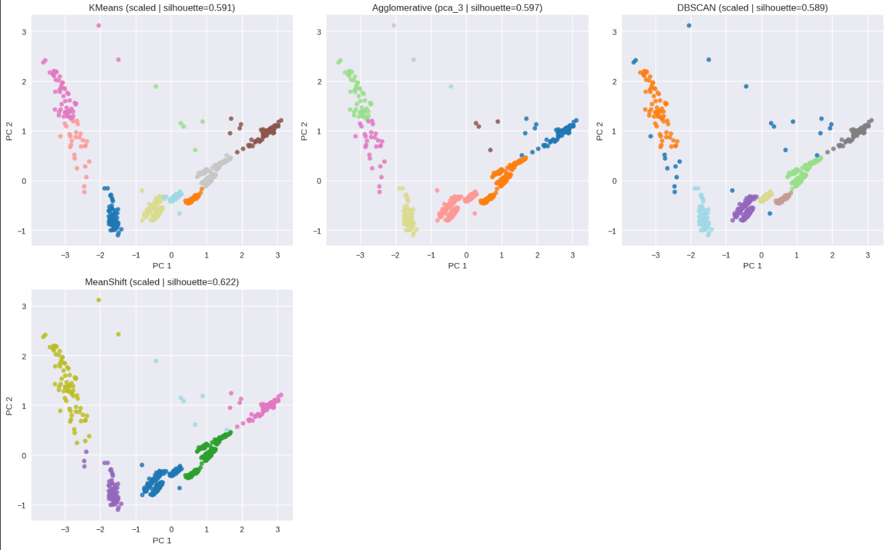
  <figcaption>PCA visualization of clustering results</figcaption>
</figure>

## Phase 5: Evaluation

The notebook evaluates clustering performance using three metrics:

1. Rand Index
2. Adjusted Rand Index
3. Silhouette Score

The Rand Index is implemented manually, as required by the project.

The evaluation results are saved to:

```text
clustering_evaluation.csv
```

Example evaluation results from the notebook:

| Algorithm | Representation | Silhouette Score | Rand Index | Adjusted Rand Index |
|---|---:|---:|---:|---:|
| MeanShift | scaled | 0.621611 | 0.846211 | 0.503930 |
| Agglomerative | pca_3 | 0.596950 | 0.843244 | 0.486491 |
| KMeans | scaled | 0.591361 | 0.939610 | reported in CSV |
| DBSCAN | scaled | 0.589252 | 0.943296 | reported in CSV |

### Metric Interpretation

The three evaluation metrics measure different aspects of clustering quality.

### Silhouette Score

Silhouette Score measures how compact and separated the clusters are in the feature space. A higher value means samples are closer to their own cluster and farther from other clusters.

This metric does not use the true class labels.

### Rand Index

Rand Index compares the predicted cluster assignments with the true material labels. It counts how many pairs of samples are consistently assigned together or separately in both the ground truth and the predicted clustering.

The notebook implements this metric manually.

### Adjusted Rand Index

Adjusted Rand Index is a corrected version of Rand Index. It adjusts the result based on what could happen by random chance.

Because of this correction, ARI is usually more strict than RI.

### Why the values are different

The values are different because each metric evaluates clustering from a different perspective:

- Silhouette Score only checks geometric separation in feature space.
- Rand Index compares pairwise agreement with real labels.
- Adjusted Rand Index compares with real labels while correcting for random agreement.

Therefore, an algorithm may produce compact clusters with a good Silhouette Score but still not match the real material classes perfectly.

### Required screenshot: evaluation table

<figure>
  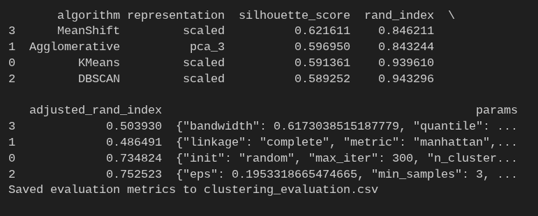
  <figcaption>Evaluation results table</figcaption>
</figure>

## Phase 6: Prediction on Test Images

In the prediction phase, the notebook uses the trained KMeans model to assign clusters to test images.

The process is:

1. Extract the same selected features from test images.
2. Scale the test features using the training scaler.
3. Predict the cluster using the trained KMeans model.
4. Assign a class label to each predicted cluster using majority vote from the training samples.
5. Display test predictions.
6. Visualize each selected test image with two similar training images from the same predicted cluster.

The notebook also reports test accuracy for the clustering algorithms.

Reported test accuracy values:

```text
KMeans test accuracy: 0.7778
Agglomerative test accuracy: 0.5556
DBSCAN test accuracy: 0.7407
MeanShift test accuracy: 0.5556
```

### Required screenshot: test prediction table

<figure>
  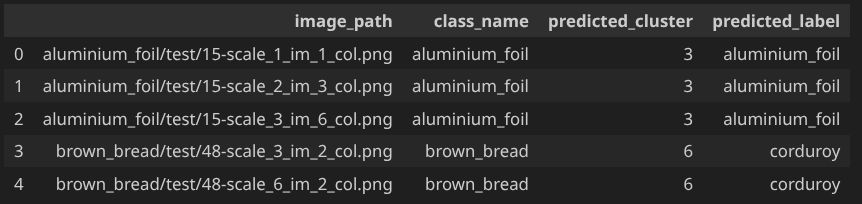
  <figcaption>Test image prediction table</figcaption>
</figure>

### Required screenshot: test accuracy output

<figure>
  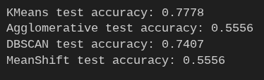
  <figcaption>Test accuracy results</figcaption>
</figure>

### Required screenshot: test image retrieval examples

<figure>
  
  <figcaption>Test sample with two cluster peers</figcaption>
</figure>

## Generated Files

After running the notebook, the following files are generated:

```text
features_all.csv
selected_features.csv
clustering_evaluation.csv
```

### `features_all.csv`

Contains all extracted image features.

Columns include:

- `image_path`
- `class_name`
- `split`
- 30 handcrafted feature columns

### `selected_features.csv`

Contains the final selected feature subset.

In this notebook, the selected features are:

```text
lab_mean_b
hsv_mean_s
hsv_mean_h
```

### `clustering_evaluation.csv`

Contains clustering evaluation results for all algorithms.

Columns include:

- `algorithm`
- `representation`
- `silhouette_score`
- `rand_index`
- `adjusted_rand_index`
- `params`

## How to Run the Project

## 1. Clone or download the project

Place the notebook and dataset folders in the same root directory.

## 2. Install dependencies

Install the required Python packages:

```bash
pip install numpy pandas matplotlib seaborn scikit-image scikit-learn tqdm
```

Recommended Python version:

```text
Python 3.10+
```

## 3. Run the notebook

Open Jupyter Notebook or Jupyter Lab:

```bash
jupyter notebook
```

Then open and run:

```text
image-clustering.ipynb
```

Run all cells from top to bottom.

## 4. Check generated outputs

After successful execution, confirm that these files exist:

```text
features_all.csv
selected_features.csv
clustering_evaluation.csv
```

## Notes

- The notebook uses relative paths, so it should run correctly when the dataset folders are placed next to the notebook.
- Feature extraction is cached in `features_all.csv`; if the feature extraction code changes, delete this file and rerun the notebook.
- No pretrained model is used for feature extraction.
- KMeans is used as the main trained clustering model for the final prediction phase.
- The evaluation CSV file is required as part of the final project output.

